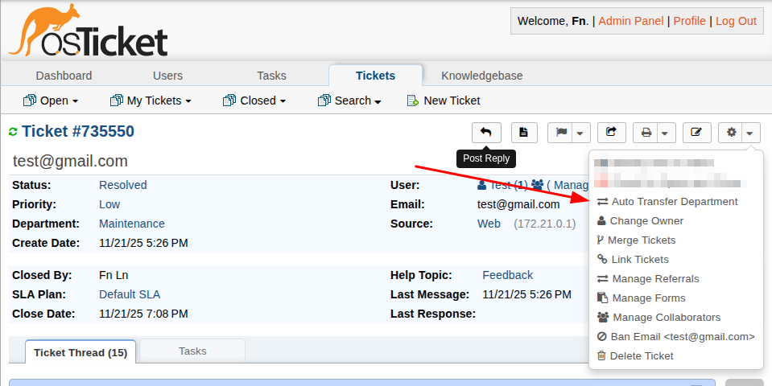

# AI Auto Department Transfer Plugin for osTicket

This plugin for [osTicket](https://github.com/osTicket/osTicket) automatically transfers tickets to appropriate departments based on keywords found in the subject, body, and attached files. It uses AI (OpenAI or compatible APIs) to analyze images and select the optimal department when multiple matches are found.

## Features

- **Automatic processing** of new tickets on creation
- **Manual trigger** via button in ticket view
- **Content analysis**: subject, message body, attached files
- **File format support**: 
  - Images (JPG, JPEG, PNG, GIF, WebP) - via AI Vision API
  - PDF - via pdftotext (if installed)
  - Word (.doc, .docx) - via antiword or unzip (if installed)
- **Intelligent department selection** using AI when multiple matches are found
- **Multiple API providers**: OpenAI or any OpenAI-compatible API endpoint
- **Wide model selection**: GPT-5, GPT-4.1, GPT-4o, o-series reasoning models, and custom models
- **Temperature control** for fine-tuning AI response behavior
- **Internal notes** for each transfer operation, including analyzed file content (optional) and list of ignored files with reasons
- **Flexible rule configuration** via user-friendly table interface
- **Department-based access control** for manual transfer button
- **Debug logging** for troubleshooting

## Installation

1. Copy the `osticket-ai-auto-dept-transfer` folder to `/include/plugins/`
2. Navigate to admin panel: **Admin Panel → Manage → Plugins**
3. Find "AI Auto Department Transfer" and click **Install**
4. After installation, click on the plugin to configure

## Configuration

### API Settings

1. **API Provider** - choose API provider type:
   - `Open AI` - use OpenAI API (default)
   - `Custom` - use custom OpenAI-compatible API endpoint

2. **API Key** - your API key (required)
   - For OpenAI: get one at https://platform.openai.com/api-keys
   - For Custom: use your provider's API key

3. **API URL** - custom API endpoint URL (only for Custom provider)
   - Must be OpenAI-compatible endpoint
   - Example: `https://api.example.com/v1/chat/completions`
   - For OpenAI provider, this is set automatically

4. **Model Name** - AI model to use for analysis:
   - **GPT-5 series** (latest):
     - `gpt-5.2` - Latest, improved reasoning
     - `gpt-5.1` - Coding & agentic tasks
     - `gpt-5.1-codex` / `gpt-5.1-codex-mini` / `gpt-5.1-codex-max` - Optimized for code
     - `gpt-5-mini` - Fast, 400K context
     - `gpt-5-nano` - Fastest, cheapest
   - **Reasoning models** (o-series, think longer before responding):
     - `o3` - Most advanced reasoning
     - `o3-mini` - Cost-efficient reasoning
     - `o4-mini` - Latest compact reasoning
     - `o1` / `o1-mini` - Extended/compact reasoning
   - **GPT-4.1 series** (improved coding & long context):
     - `gpt-4.1` - Best for coding, 1M context
     - `gpt-4.1-mini` / `gpt-4.1-nano` - Balanced/fastest
   - **GPT-4o series** (multimodal):
     - `gpt-4o` - Multimodal, capable
     - `gpt-4o-mini` - Fast and affordable (recommended)
   - **Legacy models**:
     - `gpt-4-turbo` / `gpt-3.5-turbo`
   - For Custom provider: enter any model name manually

5. **Temperature** - controls response randomness (0.0-2.0)
   - Lower values = more deterministic responses
   - Higher values = more creative/random responses
   - Default: `0.3` (recommended for classification tasks)

6. **API Timeout** - maximum wait time for API response (seconds)

### Processing Settings

1. **Max File Size** - maximum file size to process for text extraction (MB)

2. **Auto-transfer on ticket creation** - automatically analyze and transfer new tickets

3. **Include analyzed file content in the transfer decision message** (`show_files_content`)  
   - When enabled, internal notes will include the extracted text from processed attachments.
   - Always shows a list of ignored files (if any) with the reason.

4. **Enable Debug Logging** - log processing details and AI requests for debugging

### Departments with Manual Transfer Button

Control which departments can see the manual transfer button in the "More" dropdown based on the staff member's department:

- **Leave empty** (default) - button is visible for all staff members from any department, including newly created ones
- **Select specific departments** - button will only appear for staff members whose department is in the selected list

This setting only affects the manual button visibility. Automatic transfer works for all departments regardless of this setting.

### Department Transfer Rules

Rules are configured through a user-friendly dynamic table interface:

1. Click the **"Add Rule"** button to add a new rule
2. Select a department from the dropdown
3. Enter keywords separated by commas
4. Repeat for all necessary departments
5. Use the **"Remove"** button to delete unwanted rules

**Example configuration:**

| Department | Keywords |
|-----------|----------|
| Technical Support | password, login, authentication, forgot password |
| Billing | payment, invoice, billing, refund, subscription |
| Bug Reports | bug, error, crash, not working, broken |

**Keyword format:**
- Separated by commas or semicolons (`,` or `;`)
- Spaces after separators are automatically removed
- Case-insensitive search
- Partial text matching
- Multiple words can be used for one department

## Usage

### Automatic Processing

When "Auto-transfer on ticket creation" is enabled, the plugin automatically:
1. Analyzes each new ticket
2. Extracts text from attached files
3. Searches for keyword matches
4. Transfers ticket to the appropriate department
5. Adds an internal note with the transfer reason

### Manual Trigger

An **"Auto Transfer Department"** option appears in the "More" dropdown menu in the ticket view:
1. Open a ticket
2. Click the **"More"** button (with three dots) in the ticket toolbar
3. Select **"Auto Transfer Department"** from the dropdown menu
4. Confirm the action
5. The plugin will analyze and transfer the ticket if needed

The menu item is marked with an exchange icon (⇄) and appears at the top of the dropdown list.

## Logic

### Match Finding

1. The plugin collects all text from:
   - Ticket subject
   - Message content
   - Attached images (OCR via AI)
   - PDF files (if pdftotext is available)
   - Word documents (if antiword/unzip is available)

2. Searches for keywords from configured rules

3. Result:
   - **No matches** - adds note "No matching keywords found"
   - **One match** - ticket is transferred to that department
   - **Multiple matches** - AI selects the most appropriate department

### Internal Notes

Each operation is recorded as an internal note using poster `AI Department Detector`:
- Successful transfer: target department, reason, and (if enabled) analyzed file contents.
- No matches or errors: reason plus (if enabled) analyzed file contents.
- In all cases, ignored files (too large, unsupported, no text, or read errors) are listed with reasons.

## Requirements

### Required:
- osTicket 1.18+
- PHP 7.2+
- PHP CURL extension
- API key (OpenAI or compatible provider)

### Optional (for file processing):
- `pdftotext` - for PDF text extraction
- `antiword` - for Word .doc files
- `catdoc` - fallback for Word .doc files
- `unzip` - for Word .docx files

Without these utilities, images will be processed via AI Vision API, and PDF/Word files will be skipped.

## Logging

When "Debug Logging" is enabled, information is written to the system log:
- Details of each ticket processing
- OpenAI API requests and responses
- Found keyword matches
- Errors and exceptions

Log viewing: depends on server configuration (usually `/var/log/apache2/error.log` or `/var/log/nginx/error.log`)

## Examples

### Support by Level

| Department | Keywords |
|-----------|----------|
| Level 1 Support | simple question, how to, help, guide, instruction |
| Level 2 Support | not working, error, bug, problem, critical |
| Development | development, new feature, enhancement, API |

### By Request Type

| Department | Keywords |
|-----------|----------|
| Billing | bill, payment, invoice, billing, subscription |
| Refunds | refund, money, compensation, return |
| Legal | contract, agreement, legal, terms |

## Troubleshooting

### Plugin doesn't transfer tickets

1. Check that "Auto-transfer on ticket creation" is enabled
2. Ensure API key is correct
3. Verify rules are configured (departments selected and keywords entered)
4. Enable Debug Logging and check logs

### Files are not processed

1. Check file sizes (don't exceed Max File Size)
2. For PDF/Word: install pdftotext/antiword/catdoc utilities
3. For images: verify model supports Vision API (gpt-4o, gpt-4o-mini, or compatible)

### API Errors

- Check API account balance (for OpenAI)
- Increase API Timeout if requests are timing out
- Verify API key correctness
- For Custom provider: ensure API URL is correct and endpoint is OpenAI-compatible
- Check Temperature value is within range (0.0-2.0)

### Manual transfer button not visible

1. Check "Departments with Manual Transfer Button" setting
2. Ensure staff member's department is in the allowed list (or leave empty for all)

## Usage Costs

OpenAI API is paid, approximate prices (may vary):
- **GPT-4o-mini**: ~$0.15 per 1M input tokens (recommended)
- **GPT-4o**: ~$5 per 1M input tokens
- **GPT-4.1 series**: varies by tier
- **o-series (reasoning)**: premium pricing
- **Vision API**: ~$0.01 per image

For Custom API providers, check your provider's pricing.

Recommendation: use `gpt-4o-mini` for most tasks - it provides the best balance of cost and quality for classification.

## Authors

- Anatoly Melnikov

## License

This plugin is licensed under the GNU General Public License v2 (GPL-2.0).

This program is free software; you can redistribute it and/or modify it under the terms of the GNU General Public License as published by the Free Software Foundation; either version 2 of the License, or (at your option) any later version.

This program is distributed in the hope that it will be useful, but WITHOUT ANY WARRANTY; without even the implied warranty of MERCHANTABILITY or FITNESS FOR A PARTICULAR PURPOSE. See the GNU General Public License for more details.

You should have received a copy of the GNU General Public License along with this program; if not, write to the Free Software Foundation, Inc., 51 Franklin Street, Fifth Floor, Boston, MA 02110-1301, USA.

See the [LICENSE](LICENSE) file for the full license text.
