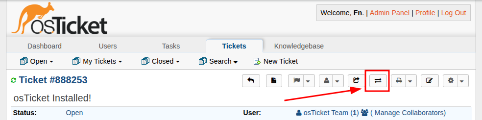

# AI Auto Department Transfer Plugin for osTicket

This plugin automatically transfers tickets to appropriate departments based on keywords found in the subject, body, and attached files. It uses OpenAI to analyze images and select the optimal department when multiple matches are found.

## Features

- **Automatic processing** of new tickets on creation
- **Manual trigger** via button in ticket view
- **Content analysis**: subject, message body, attached files
- **File format support**: 
  - Images (JPG, JPEG, PNG, GIF, WebP) - via OpenAI Vision API
  - PDF - via pdftotext (if installed)
  - Word (.doc, .docx) - via antiword or unzip (if installed)
- **Intelligent department selection** using AI when multiple matches are found
- **Internal notes** for each transfer operation
- **Flexible rule configuration** via user-friendly table interface
- **Debug logging** for troubleshooting

## Installation

1. Copy the `osticket-ai-auto-dept-transfer` folder to `/include/plugins/`
2. Navigate to admin panel: **Admin Panel → Manage → Plugins**
3. Find "AI Auto Department Transfer" and click **Install**
4. After installation, click on the plugin to configure

## Configuration

### Basic Settings

1. **OpenAI API Key** - your OpenAI API key (required)
   - Get one at https://platform.openai.com/api-keys

2. **OpenAI Model** - model to use:
   - `gpt-4o` - most capable, expensive
   - `gpt-4o-mini` - fast and affordable (recommended)
   - `gpt-4-turbo` - balance of speed and quality
   - `gpt-3.5-turbo` - cheapest

3. **API Timeout** - maximum wait time for OpenAI response (seconds)

4. **Auto-transfer on ticket creation** - automatically process new tickets

5. **Max File Size** - maximum file size to process (MB)

6. **Enable Debug Logging** - enable detailed logging

### Department Transfer Rules

Rules are configured through a user-friendly dynamic table interface:

1. Click the **"Add Rule"** button to add a new rule
2. Select a department from the dropdown
3. Enter keywords separated by commas
4. Repeat for all necessary departments
5. Use the **"Remove"** button to delete unwanted rules

**Example configuration:**

| Department | Keywords |
|-----------|----------|
| Technical Support | password, login, authentication, forgot password |
| Billing | payment, invoice, billing, refund, subscription |
| Bug Reports | bug, error, crash, not working, broken |

**Keyword format:**
- Separated by commas or semicolons (`,` or `;`)
- Spaces after separators are automatically removed
- Case-insensitive search
- Partial text matching
- Multiple words can be used for one department

## Usage

### Automatic Processing

When "Auto-transfer on ticket creation" is enabled, the plugin automatically:
1. Analyzes each new ticket
2. Extracts text from attached files
3. Searches for keyword matches
4. Transfers ticket to the appropriate department
5. Adds an internal note with the transfer reason

### Manual Trigger

An **"Auto Transfer Department"** button appears in the ticket view:
1. Open a ticket
2. Click the "Auto Transfer Department" button
3. Confirm the action
4. The plugin will analyze and transfer the ticket if needed

## Logic

### Match Finding

1. The plugin collects all text from:
   - Ticket subject
   - Message content
   - Attached images (OCR via AI)
   - PDF files (if pdftotext is available)
   - Word documents (if antiword/unzip is available)

2. Searches for keywords from configured rules

3. Result:
   - **No matches** - adds note "No matching keywords found"
   - **One match** - ticket is transferred to that department
   - **Multiple matches** - AI selects the most appropriate department

### Internal Notes

Each operation is recorded as an internal note:
- Successful transfer: target department and reason
- No matches: information that no keywords were found
- Errors: details for debugging

## Requirements

### Required:
- osTicket 1.14+
- PHP 7.2+
- PHP CURL extension
- OpenAI API key

### Optional (for file processing):
- `pdftotext` - for PDF text extraction
- `antiword` - for Word .doc files
- `catdoc` - fallback for Word .doc files
- `unzip` - for Word .docx files

Without these utilities, images will be processed via OpenAI Vision API, and PDF/Word files will be skipped.

## Logging

When "Debug Logging" is enabled, information is written to the system log:
- Details of each ticket processing
- OpenAI API requests and responses
- Found keyword matches
- Errors and exceptions

Log viewing: depends on server configuration (usually `/var/log/apache2/error.log` or `/var/log/nginx/error.log`)

## Examples

### Support by Level

| Department | Keywords |
|-----------|----------|
| Level 1 Support | simple question, how to, help, guide, instruction |
| Level 2 Support | not working, error, bug, problem, critical |
| Development | development, new feature, enhancement, API |

### By Request Type

| Department | Keywords |
|-----------|----------|
| Billing | bill, payment, invoice, billing, subscription |
| Refunds | refund, money, compensation, return |
| Legal | contract, agreement, legal, terms |

## Troubleshooting

### Plugin doesn't transfer tickets

1. Check that "Auto-transfer on ticket creation" is enabled
2. Ensure OpenAI API key is correct
3. Verify rules are configured (departments selected and keywords entered)
4. Enable Debug Logging and check logs

### Files are not processed

1. Check file sizes (don't exceed Max File Size)
2. For PDF/Word: install pdftotext/antiword/catdoc utilities
3. For images: verify model supports Vision API (gpt-4o, gpt-4o-mini)

### API Errors

- Check OpenAI account balance
- Increase API Timeout if requests are timing out
- Verify API key correctness

## Usage Costs

OpenAI API is paid, approximate prices:
- **GPT-4o-mini**: ~$0.15 per 1M input tokens
- **GPT-4o**: ~$5 per 1M input tokens
- **Vision API**: ~$0.01 per image

Recommendation: use gpt-4o-mini for most tasks.

## Authors

- Pavel Bahdanau
- Anatoly Melnikov

## License

This plugin is licensed under the GNU General Public License v2 (GPL-2.0).

This program is free software; you can redistribute it and/or modify it under the terms of the GNU General Public License as published by the Free Software Foundation; either version 2 of the License, or (at your option) any later version.

This program is distributed in the hope that it will be useful, but WITHOUT ANY WARRANTY; without even the implied warranty of MERCHANTABILITY or FITNESS FOR A PARTICULAR PURPOSE. See the GNU General Public License for more details.

You should have received a copy of the GNU General Public License along with this program; if not, write to the Free Software Foundation, Inc., 51 Franklin Street, Fifth Floor, Boston, MA 02110-1301, USA.

See the [LICENSE](LICENSE) file for the full license text.
